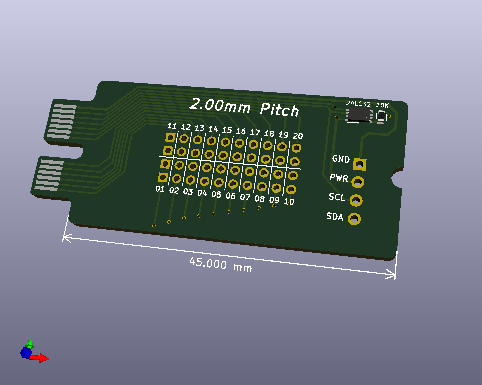

Rapid Prototyping Board - 2.00mm Pitch Card
-------------------------------------------

 

Bill Of Materials
----------------
  
- PCB from KiCad project.kicad_pcb file  
- 1 ea., RES 10K OHM 5% 1/10W 0603, https://www.digikey.com/short/h4w9vtd1
- 1 ea., IC EEPROM 32KBIT I2C, Microchip 24LC32AT-I/MC, https://www.digikey.com/short/r3f225vm

License
----------------
[Attribution-ShareAlike 3.0 United States (CC BY-SA 3.0 US)](https://creativecommons.org/licenses/by-sa/3.0/us/)

You are free to:

- Share — copy and redistribute the material in any medium or format
- Adapt — remix, transform, and build upon the material

Under the following terms:

- Attribution — You must give appropriate credit, provide a link to the license, and indicate if changes were made. You may do so in any reasonable manner, but not in any way that suggests the licensor endorses you or your use.
- ShareAlike — If you remix, transform, or build upon the material, you must distribute your contributions under the same license as the original.