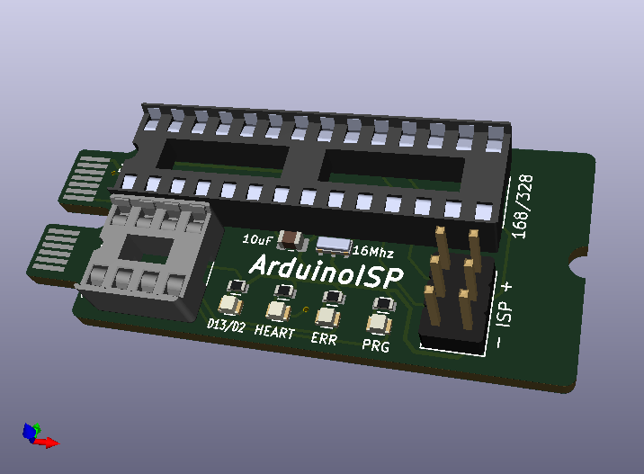

Rapid Prototyping Board - ArduinoISP Card
---------------------------------------
 

What is it?
-----------

- Use RPB as an ISP programmer. 
- Sockets for Atmega8/168/328 & Attiny25/24/85.
- ISP jumper for on-board programming.
- D13 (Atmega) and D2 (Attiny) LED for troubleshooting.
- Fused to prevent reversed Attiny meltdown!

Bill Of Materials
----------------
  
- 1 ea., Perfect Purple PCB from OSH Park, with not so perfect layout from kicad.pcb file.
- 2 ea., C1 CAP CER 10UF 10V X5R 0805, Kemet C0805C106K8PAC7800, https://www.digikey.com/short/32v75tfv
- 2 ea., SMD LED GREEN 0603, Lite-On LTST-C191KGKT, https://www.digikey.com/short/ptwhtwz2
- 1 ea., SMD LED RED 0603,
- 1 ea., SMD LED YELLOW 0603,
- 1 ea., PTC RESET FUSE 20V 54MA 0805, Murata PRG21AR420MB1RA, https://www.digikey.com/short/2nmhrbvf
- 4 ea., Resistor 1K OHM SMD 0603, Stackpole RNCP0603FTD1K00, https://www.digikey.com/short/704h9hfn
- 1 ea., CONN IC DIP SOCKET 28POS TIN, On Shore ED281DT, https://www.digikey.com/short/d8nq4rd3
- 1 ea., CONN IC DIP SOCKET 8POS, On Shore ED08DT, https://www.digikey.com/short/3tnrjzh5
- 1 ea., 6-PIN SOCKET/SOCKET IDC CABLE, Adafruit 371, https://www.digikey.com/short/b992qfbd
- 1 ea., CONN HEADER VERT 6POS 2.54MM, Amphenol 77313-118-06LF, https://www.digikey.com/short/r2d1pw4f

License
----------------
[Attribution-ShareAlike 3.0 United States (CC BY-SA 3.0 US)](https://creativecommons.org/licenses/by-sa/3.0/us/)

You are free to:

- Share — copy and redistribute the material in any medium or format
- Adapt — remix, transform, and build upon the material

Under the following terms:

- Attribution — You must give appropriate credit, provide a link to the license, and indicate if changes were made. You may do so in any reasonable manner, but not in any way that suggests the licensor endorses you or your use.
- ShareAlike — If you remix, transform, or build upon the material, you must distribute your contributions under the same license as the original.