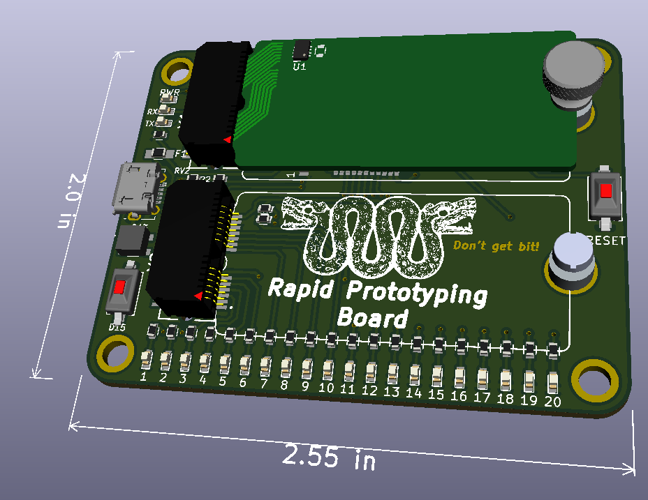

Rapid Prototyping Board
-------------------------------

 

What is it?

- Basically a 32U4 based Arduino with two card-edge slots instead of a shield layout.

Why?

- It started out as a 20-pin cable tester (Use Case 1), but morphed into a more generic prototyping system.

Features:

- USB programable Atmega 32U4.
- 20 i/o lines on card 1 position.
- Power, i2c, SPI on both card positions.
- Ability to check what card is plugged in each bay.

License
----------------
[Attribution-ShareAlike 3.0 United States (CC BY-SA 3.0 US)](https://creativecommons.org/licenses/by-sa/3.0/us/)

You are free to:

- Share — copy and redistribute the material in any medium or format
- Adapt — remix, transform, and build upon the material

Under the following terms:

- Attribution — You must give appropriate credit, provide a link to the license, and indicate if changes were made. You may do so in any reasonable manner, but not in any way that suggests the licensor endorses you or your use.
- ShareAlike — If you remix, transform, or build upon the material, you must distribute your contributions under the same license as the original.